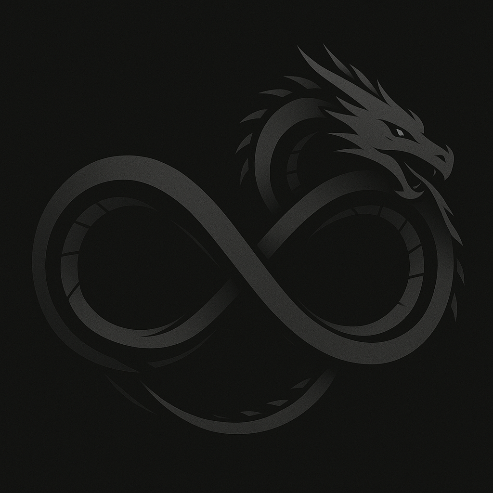
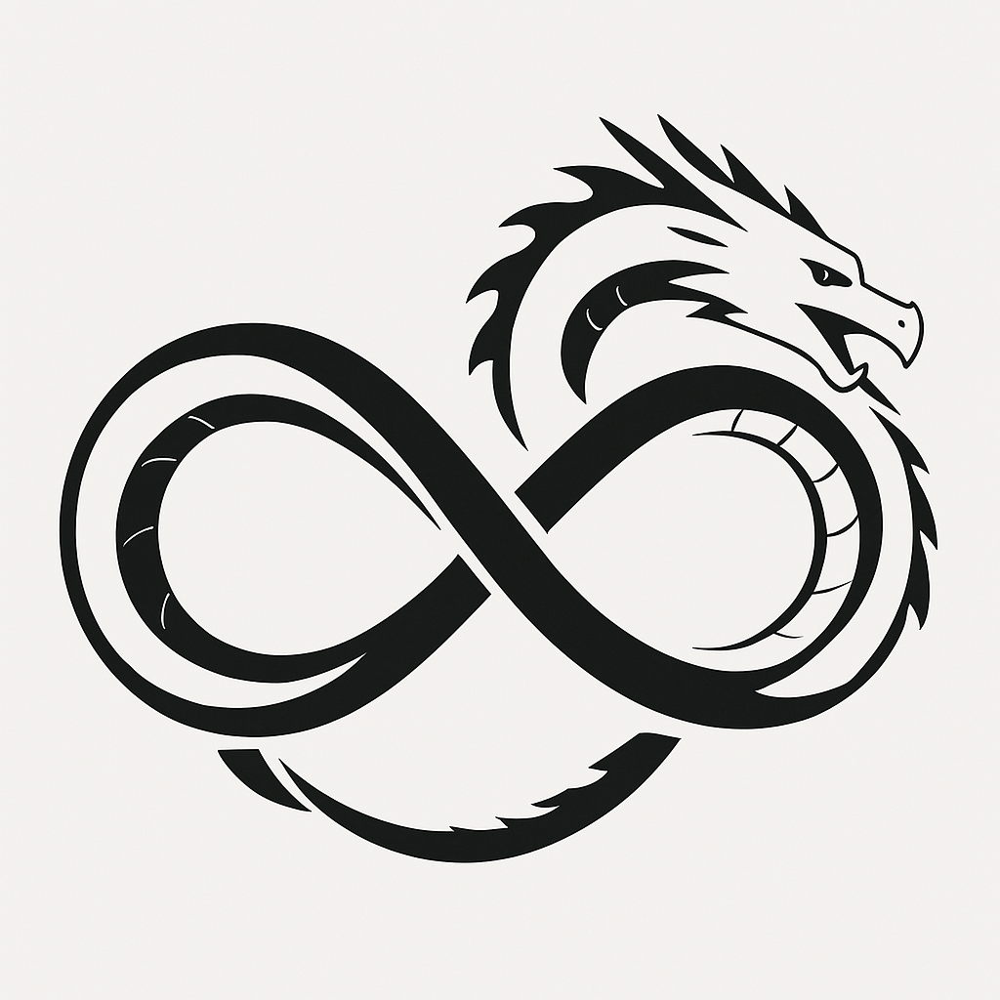
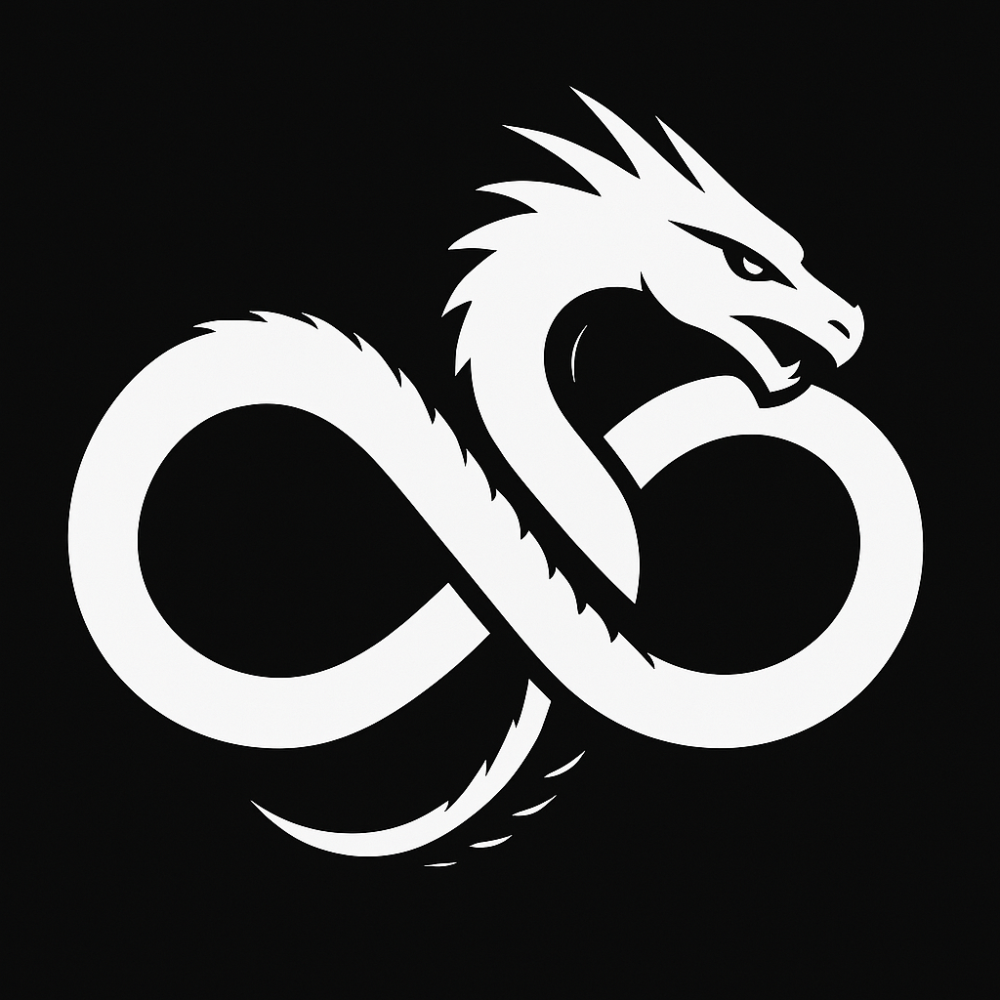

Infinity Dragon Logo - Prototype
Overview
This repository contains the prototype of the "Infinity Dragon" logo, a symbol designed to represent my brand, Intepuls, and its core values. The logo showcases a dragon eating its own tail, forming an infinite loop, symbolizing the never-ending cycle of growth, rebirth, and transformation. It embodies the concept of infinite progress—endlessly evolving, just like the continuous pursuit of excellence in my journey as a cybersecurity researcher, hacker, and entrepreneur.

Logo Design Concept
Shape and Symbolism: The dragon eating its tail forms the shape of an infinity symbol. This represents the infinite potential for progress, self-improvement, and knowledge. The dragon, a timeless mythical creature, signifies power, wisdom, and resilience, characteristics that I strive to embody.

Meaning: The design highlights the cyclical nature of growth. The act of the dragon consuming its own tail is symbolic of constantly improving upon oneself, learning from past experiences, and pushing boundaries without limits. This logo aligns with my vision of building a lasting legacy that extends beyond personal growth, impacting generations to come.

## Images
Here are the different versions of the logo as they evolve:

### Prototype 1

### Prototype 2

### Prototype 3

Current Status
This logo is still in its early stages and should be considered a prototype. It is a visual representation of the direction I am taking with my personal brand and future endeavors. The design will evolve as I refine the concept, but it serves as the foundation for the identity of my brand Intepuls and the "Infinity Dragon" mark.

License
This logo is copyrighted and remains the intellectual property of the creator. It is not available for use or modification without explicit permission. Please respect the rights associated with this work.

Future Updates
The logo will undergo further refinements, including adjustments to color, style, and other design elements to better align with the finalized brand identity.

